# Library Manager

This is Repo of Library Manager Project done as OOPM Project in S.E.  
Developed By Tejas Ghone, Vatsal Soni,Yashodhan Joshi and Yatharth Vyas.

## Details

This is a JAVA Swing GUI based Program.
Basic program for a library Management System.

###  Usage
By default the project assumes the SQL setup is done in 'library' database, with user 'library' and password 'library'.
In case a different setup is required please change the dbName , userName and password fields in Connect.java file and compile.  

Initially, Setup a SQL Database as per the library.sql file, change the admin table entries as per requirements.   
Compile all Java Files in the src folder.  
Run the Loading.Class file generated.  

### Images :

#### Loading 
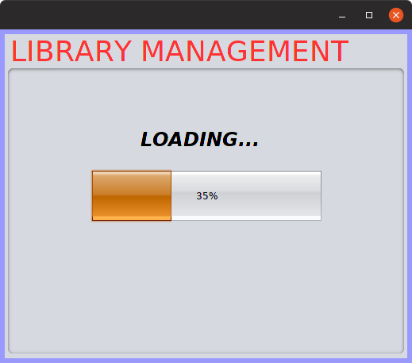

#### Login 
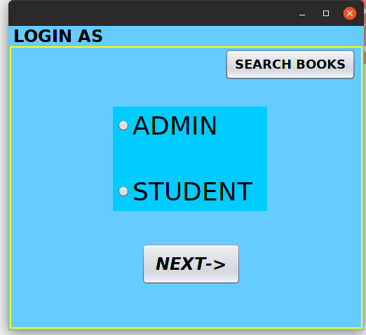

#### Book Search 
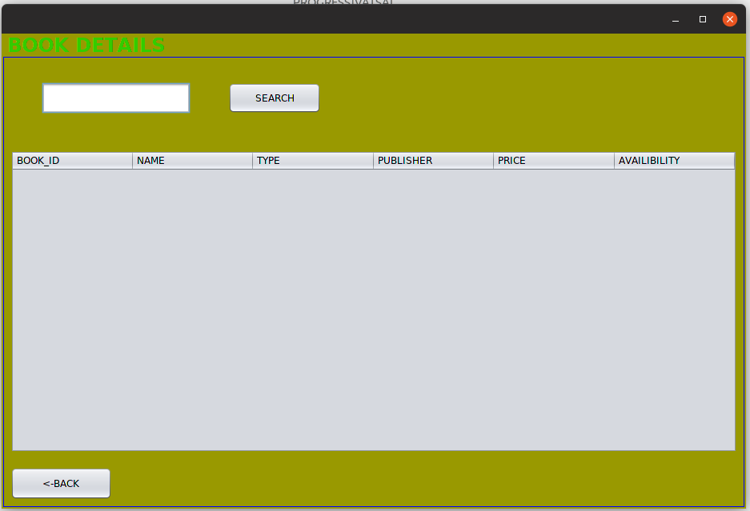

#### Admin Login 
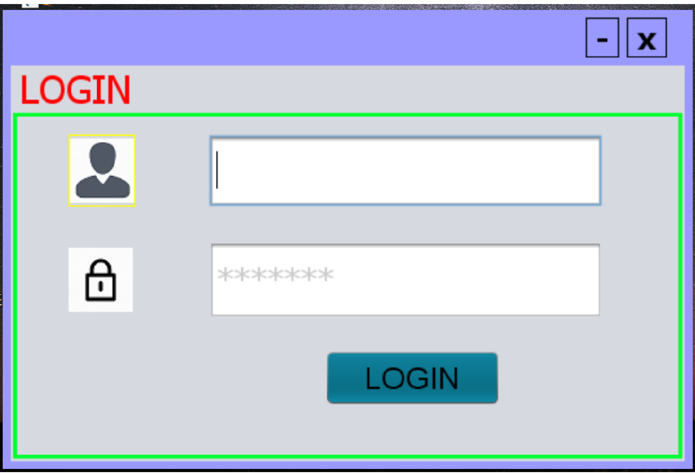

#### Admin Home 
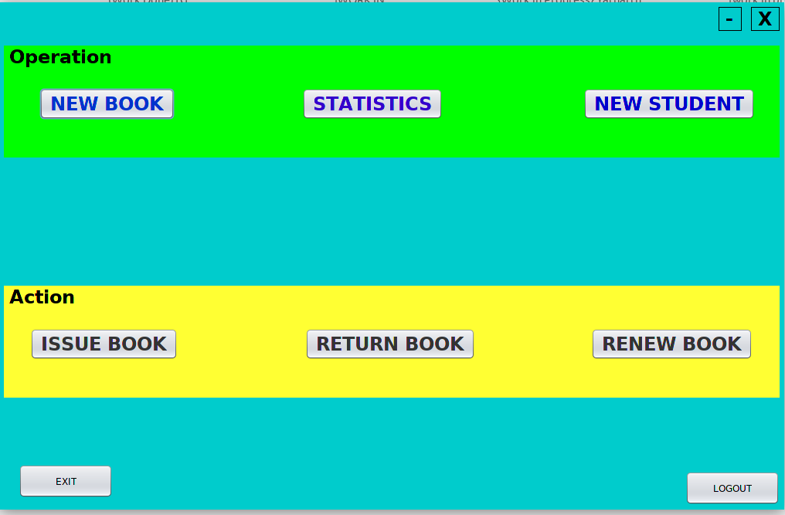

#### New Book 
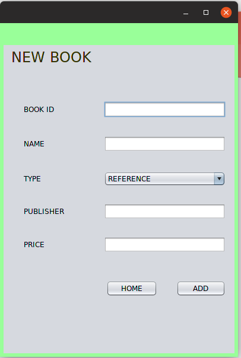

#### Issue Details or Statistics
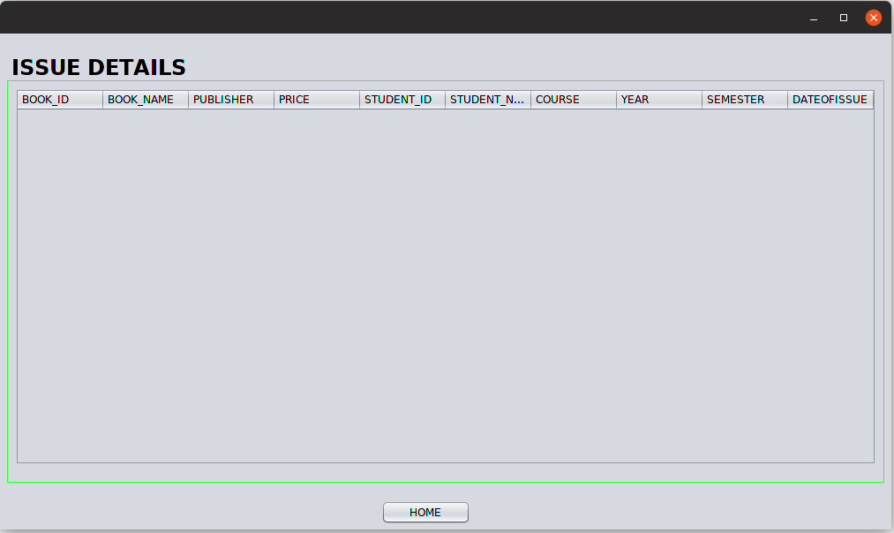

#### Add Student 
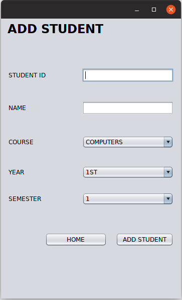

#### Book Issue 
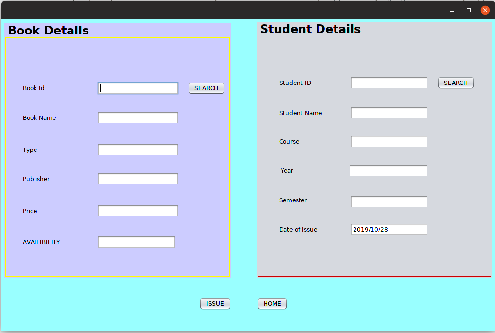

#### Book Return 
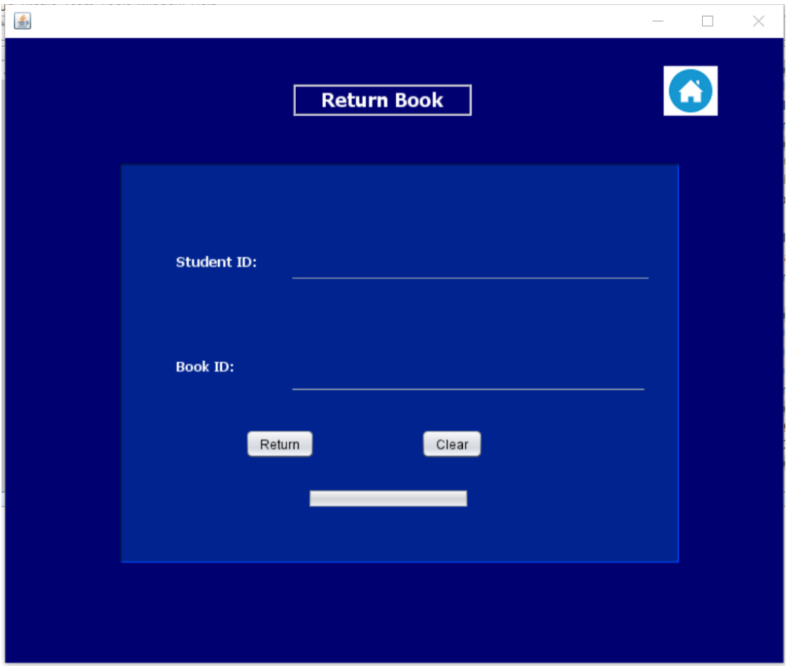

#### Book Re-issue 
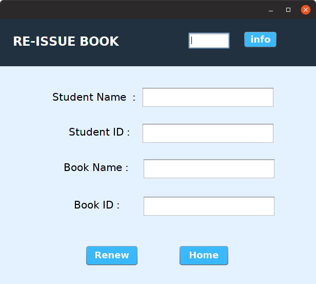

#### Student Home 
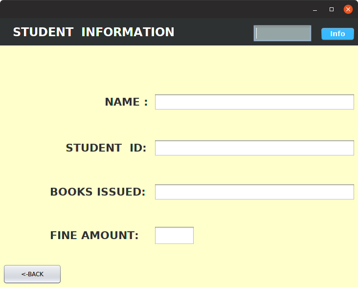

